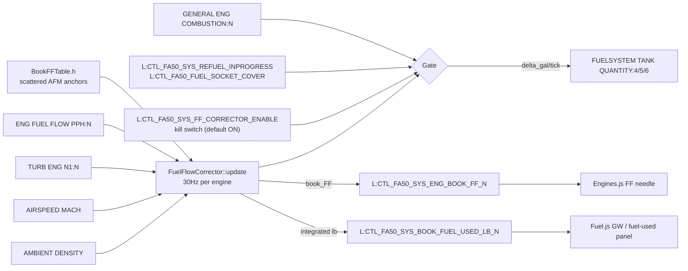

# Engine Tune Phase 5 - WASM Fuel-Flow Corrector

Custom per-tick fuel-flow correction inside `falcon50-system` WASM. Targets the residual band-spread left by Phase 4 (M.80 -5 to -12% under, LRC high-alt +6 to +9% over) that the 1-D `JET_density_on_FF_table` knot grid cannot resolve.

Status: **SHIPPED (skeleton), AWAITING IN-SIM VERIFICATION**.

## What changed

New WASM `FsModel` `FuelFlowCorrector` and a constexpr AFM-sourced book FF lookup table (`BookFFTable.h`). Runs at the same 30 Hz cadence as `AircraftSystem`, after `EngInstrument` so the FF needle reads the corrected value in the same tick.

| Layer | File | Change |
|---|---|---|
| WASM | `codes/wasm/falcon50-system/src/models/internals/system/fuel/BookFFTable.h` | New constexpr anchor table + inverse-distance lookup |
| WASM | `codes/wasm/falcon50-system/src/models/internals/system/fuel/FuelFlowCorrector.h/.cpp` | New per-engine corrector model |
| WASM | `codes/wasm/falcon50-system/src/tasks/AircraftSystem.h/.cpp` | Register + update FuelFlowCorrector |
| WASM | `codes/wasm/falcon50-system/falcon50-system.vcxproj(.filters)` | Add new compile/include items |
| JS | `msfs-projects/.../FA50Core.js` | Register 10 new LVars (kill switch + book FF + delta + book-fuel-used) |
| JS | `msfs-projects/.../System_Core/Engines.js` | FF needle reads `SYS_ENG_BOOK_FF_N` when corrector enabled |
| JS | `msfs-projects/.../System_Core/Fuel.js` | Fuel-used / GW counter reads `SYS_BOOK_FUEL_USED_LB_N` when corrector enabled |

`engines.cfg` is untouched - the cfg curve is now the "no-correction baseline".

## Architecture



## Why no shadow tanks

```
sim drain : tank -= sim_FF * dt
our delta : tank -= (book_FF - sim_FF) * dt
net       : tank -= book_FF * dt    <- single source of truth for FF
```

All refuel paths (EFB, fuel panel, sim world map, `Fuel.js _applyFuelState`) write `FUELSYSTEM TANK QUANTITY` directly. The corrector gates on `SYS_REFUEL_INPROGRESS` / `FUEL_SOCKET_COVER` exactly as `Fuel.js maintainFeederStandpipes` does, so no write races.

## LUT design

`BookFFTable.h` defines `kBookFFAnchors[]` - scattered AFM cells keyed on `(N1 percent, Mach, rho slug/ft^3)` returning FF in PPH. Lookup is **inverse-squared-distance weighted average of the K=4 nearest anchors** in normalized axis space.

Why scattered + IDW instead of a regular 3-D grid:

- AFM cells are not on a rectangular grid in `(N1, M, rho)` space. LRC cells trace a curve through the envelope; M.80 cells live on a single Mach iso-surface.
- A regular grid would force ~80% of cells to be invented/extrapolated, polluting the LUT with synthetic data that masks the AFM signal.
- IDW with clamped input means off-grid op points (idle, near-empty, low-Mach descent) lean toward the nearest book anchors instead of extrapolating into nonsense.

Anchor coverage (initial set, ~35 cells, GW = 32 klb):

- **LRC band**: FL000 through FL450 at dISA +0, plus FL350/FL410 cold + hot day cells
- **M.80 band**: FL270 through FL410 at dISA +0, plus FL350/FL370/FL410 cold day cells
- **M.75 mid-cruise**: 3 cells (FL250/FL300/FL350)
- **TOGA/idle clamp**: SL TOGA, SL idle, descent idle at 3 altitudes (anchors the low end of the (N1, Mach) envelope)

The Phase 4 verification cards (E6 FL350 LRC, H8 FL350 M.80, D6 FL410 LRC) are explicitly anchored. Cross-checks at mid-grid points (e.g. FL310 LRC, FL370 M.80) test interpolation quality.

## Kill switch and gates

| LVar | Type | Default | Effect when off / triggered |
|---|---|---|---|
| `CTL_FA50_SYS_FF_CORRECTOR_ENABLE` | bool | **ON** | Skips the entire correction loop. FF needle falls back to sim FF, GW/fuel-used panel falls back to `generalEngFuelUsedSinceStart`. Use for A/B testing in flight. |
| `CTL_FA50_SYS_REFUEL_INPROGRESS` | bool | off | Skips the tick. Lets the refuel path own the tank-quantity write. |
| `CTL_FA50_FUEL_SOCKET_COVER` | bool | closed | Same as above (manual fuel panel open). |
| `GENERAL ENG COMBUSTION:N` | bool | off | Skips that engine. Lets sim handle flameout/start naturally. |
| Feeder `< 5 gal` | - | - | Skips that engine. Avoids near-empty oscillation. |

`dt > 0.5 s` is also a hard skip (sim-rate jump, pause/unpause).

## Per-engine LVars published

| LVar | Unit | Purpose |
|---|---|---|
| `CTL_FA50_SYS_ENG_BOOK_FF_N` | PPH | Book FF for the current operating point. Engines.js reads this when corrector enabled. |
| `CTL_FA50_SYS_FF_DELTA_PPH_N` | PPH | `book_FF - sim_FF`. Debug only; useful for spot-checking correction magnitude in-flight. |
| `CTL_FA50_SYS_BOOK_FUEL_USED_LB_N` | LB | Monotonically increasing fuel-used integrated from book FF. Fuel.js reads this when corrector enabled. |

## Build / test cycle

1. User runs `scripts/build-solution.bat` manually (per file-boundaries rule: WASM builds are never auto-run).
2. Re-fly Phase 4 verification cards plus 2-3 mid-grid spot checks. Targets:
   - **E6 FL350 LRC**: actual within +/-2% of book 572 PPH (Phase 4 was +5.8%)
   - **H8 FL350 M.80**: actual within +/-2% of book 772 PPH (Phase 4 was -11.8%)
   - **D6 FL410 LRC**: actual within +/-2% of book 555 PPH (Phase 4 was +8.6%)
   - **Mid-grid spot checks**: FL310 LRC, FL370 M.80, FL250 M.75 within +/-3%

Record residuals in this file's `## Verification results` section once flown.

## Verification results

_(populated after first verification flight)_

| Card | Predicted (book) | Actual | Residual | Pre-Phase 5 |
|---|---|---|---|---|
| E6 FL350 LRC  | 572 | -   | -   | +5.8% over |
| H8 FL350 M.80 | 772 | -   | -   | -11.8% under |
| D6 FL410 LRC  | 555 | -   | -   | +8.6% over |

## Risks (known)

- **Initial anchor count is starter-set, not full AFM ingest.** The LUT has ~35 cells covering the main envelope; cells at extreme corners (FL450 M.80, FL000 high-N1) rely on IDW falloff. If first verification flight shows >3% residuals at mid-grid points, expand the anchor set with another AFM ingestion pass.
- **Single-weight slice.** All anchors are at GW = 32 klb. Per-engine FF is governed by the operating point (N1, M, rho), not by aircraft weight directly, so the same LUT should serve all weights. Verify at GW = 40 klb on a high-alt cruise leg as a sanity check.
- **No N1c (sqrt-theta) correction.** The LUT axis is raw N1 to match what the AFM publishes (cockpit gauge value). MSFS's `TURB ENG N1` also matches the gauge value, so they're directly comparable. If high-OAT residuals creep up, swap the axis to corrected N1 in Phase 5b.
- **MSFS `AMBIENT DENSITY` unit string.** Requested as `"Slugs per cubic feet"`. Sanity-check rho readout via the `SYS_ENG_BOOK_FF_N` LVar after first build - obviously wrong density gives an instantly visible FF spike.

## Out of scope (Phase 5)

- N1c sqrt(theta) correction (Phase 5b refinement if anchors miss target)
- Per-engine asymmetric corrections (assume identical TFE731-3 across all 3)
- Mach-dependent TSFC modeling beyond what the LUT captures naturally
- Drag table changes (frozen per Phase 4 boundary)
- Full 9x7x6 regular grid LUT (current scattered+IDW gives better fidelity per cell)
